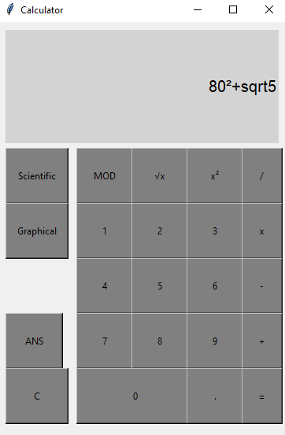

# Graphical calculator
In this repo I'm going to build a graphical calculator. There is work in progress, as for now we can only carry out basic operations.

## To do:
### 1. Basic operations:
  - [x] Arithmetic: Addition (+), Subtraction (-), Multiplication (×), Division (÷)
  - [x] Exponentiation: Power (x²)
  - [x] Square root (√x)
  - [x] Remainder or signed remainder of a division (MOD)
  - [ ] Mathematical notation
### 2. History
  - [ ] Save previous result (ANS)
  - [ ] Save previous expressions and results in a stack
### 3. Scientific mode:
  - [ ] Exponentiation: Power (xy)
  - [ ] N-th root: n-th root (n√x)  
  - [ ] Algebraic functions: Parentheses, negative numbers, scientific notation
  - [ ] Trigonometric Functions
  - [ ] Logarithms and Exponentials
### 4. Graphical mode:
  - [ ] Zeros
  - [ ] Intersections between functions
  - [ ] Max. value
### 5. GUI:
  - [x] Interface for basic mode
  - [ ] Interface for scientific mode
  - [ ] Interface for graphical mode
  - [ ] History

## 🤝 Basic mode 

## 🧪 Scientific mode 

## 🚀 Graphical mode 
