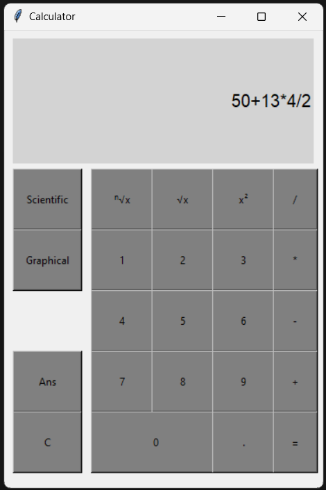

# Graphical calculator
In this repo I'm going to build a graphical calculator. There is work in progress, as for now we can only carry out basic operations.

## To do:
### 1. Basic operations:
  - [x] Arithmetic: Addition (+), Subtraction (-), Multiplication (×), Division (÷)
  - [ ] Exponentiation: Power (x^2)
  - [ ] Roots: sqrt(x), cbrt(x), x^(1/2), x^(1/3), x^(1/n) 
### 2. Scientific mode:
  - [ ] Exponentiation: Power (x^y) 
  - [ ] Algebraic functions: Parentheses, negative numbers, scientific notation
  - [ ] Trigonometric Functions
  - [ ] Logarithms and Exponentials
### 3. Graphical mode:
  - [ ] Zeros
  - [ ] Intersections between functions
  - [ ] Max. value
### 4. GUI:
  - [x] Interface for basic mode
  - [ ] Interface for scientific mode
  - [ ] Interface for graphical mode
  - [ ] History

## Basic mode 

## Scientific mode

## Graphical mode
